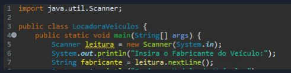

Crie uma classe chamada Moto com três atributos (marca, modelo e cilindradas) e dois métodos
(atribuir valores e retornar valores).

Na classe LocadoraVeiculos, crie um objeto do tipo Carro e dois objetos do tipo Moto, sendo
que os objetos serão criados de acordo com a solicitação desses dados ao usuário, via linha de
execução, conforme exemplo abaixo.

Após a criação dos objetos, utilize o método para retornar valores e exiba na tela o conteúdo dos
objetos criados.

Exemplo:

