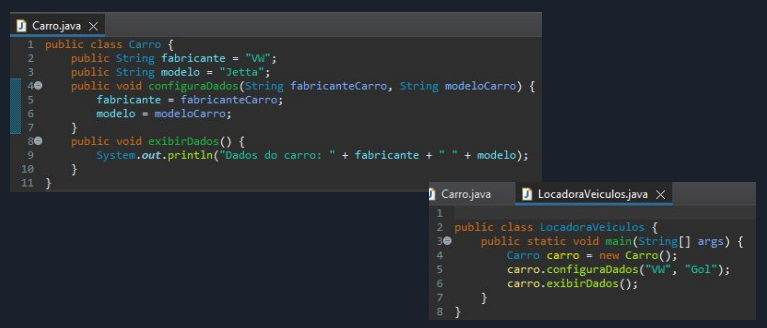

Crie um método para atribuir valores para fabricante e modelo do carro, sendo que esses
valores são recebidos pelo método através de parâmetros.

Após, implemente a classe
LocadoraVeiculos para instanciar a classe Carro, chamar o método correspondente e passar os
parâmetros necessários.

Além de um método para atribuir os valores, crie um método que
retorna os valores atribuídos.

O resultado da execução da classe LocadoraVeiculos deve ser:
Dados do carro: VW Gol

Exemplo:

