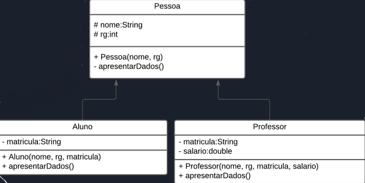

Escreva um programa orientado a objetos baseado no diagrama de classes da UML
apresentado abaixo:

Crie um objeto de cada classe, e apresente os resultados de cada uma delas na tela.

Dica:

para passar os parâmetros da sub-classe para a super-classe utilize o método
super(parâmetros).
